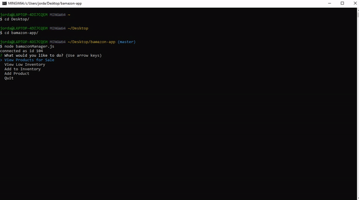

# bamazon-app

## Summary
As a customer, the bamazon app displays a product list. From that product list, customers are able to enter a product ID and the quantity of that product they wish to buy. They are then informed of the cost of their successful purchase. The product list is then updated, subracting the quantity the customer purchased from the stock quantity.  

As a manager, the bamazon app displays options to view product list, view low inventory, add stock to a specific product, and add products to the list. Once an option is selected by the manager, they can then view the requested information, or provide information on the product they wish to add stock or add to the list. 

## Functionality Video: bamazonCustomer


## Functionality Video: bamazonManager


## Technologies Used 
- HTML - Used to create elements on the DOM
- JS - Used to manipulate content on HTML
- Node - Executes JavaScript code outside of a browser
- MySQL - Open-source relational database management system
- Git - Version control system to track changes to source code
- Github - Hosts repository that can be deployed to GitHub pages

## Code Snippet
The following code shows the product function. The prompt is displayed when the bamazon customer runs the app. Once the customer answers the prompt, the product with the product ID the customer chooses is selected from the product table created in MySQL and the stock quantity is updated.
```js
function product() {
    inquirer
        .prompt([{
            name: "productID",
            type: "number",
            message: "What is the ID of the product you would like to buy?",
        }, {
            name: "quantity",
            type: "number",
            message: "How many would you like?",
        }])
        .then(function (answer) {
            connection.query("SELECT * FROM products WHERE item_id =?", [parseInt(answer.productID)], function (err, res) {
                if (err) throw err;
                if (parseInt(answer.quantity) > res[0].stock_quantity) {
                    console.log("Insufficient Quantity")
                    afterConnection();
                } else {
                    var newQuantity = res[0].stock_quantity - parseInt(answer.quantity);
                    totalCost = res[0].price*answer.quantity;
                    connection.query(
                        "UPDATE products SET ? WHERE ?",
                        [
                            {
                                stock_quantity: newQuantity
                            },
                            {
                                item_id: answer.productID
                            }
                        ],
                        function (error) {
                            if (error) throw err;
                            console.log("The total cost of your purchase is $" + totalCost)
                            console.log("Successfully purchased " + answer.quantity + " " + res[0].product_name)
                            afterConnection();
                        }
                    );
                }
            })
        });
}
```

## Author Links
https://github.com/hagoodj

https://www.linkedin.com/in/jordan-hagood/
